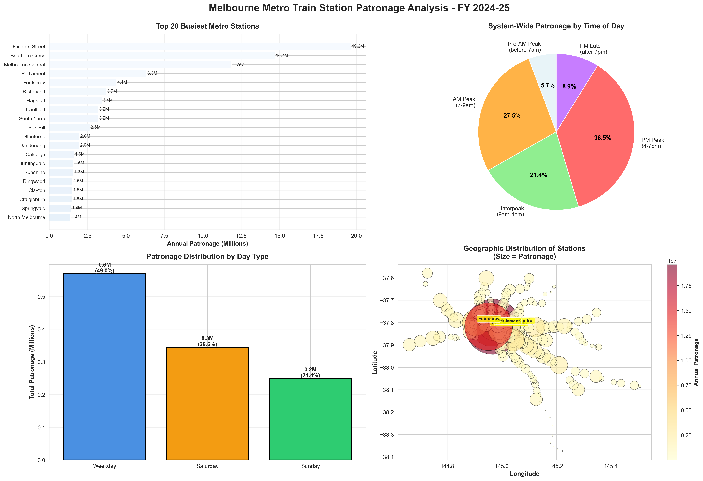

# Melbourne Metro Train Station Patronage Analysis

**Analysis of FY 2024-25 station entry patterns to identify congestion hotspots and optimization opportunities for Transport Victoria**



## Executive Summary

This analysis examines 222 Melbourne metropolitan train stations to understand patronage patterns and identify opportunities for service optimization. Key findings:

- **Peak Congestion**: 64% of system usage occurs during AM (27.5%) and PM (36.5%) peaks, creating capacity constraints
- **Top 3 Stations**: Flinders Street (19.6M), Southern Cross (14.7M), and Melbourne Central (11.9M) account for significant system load
- **Weekday Dominance**: 49% of annual patronage occurs on weekdays, indicating strong commuter dependency
- **Geographic Concentration**: CBD stations show 10-20x higher patronage than outer suburban stations

## Business Problem

Transport Victoria faces challenges in:
1. **Capacity planning**: Which stations need infrastructure investment?
2. **Service scheduling**: How to optimize train frequency during different time periods?
3. **Resource allocation**: Where should maintenance and staffing be prioritized?

**This analysis provides data-driven answers to guide Transport Victoria's infrastructure investment and operational decisions.**

## Data Source

- **Dataset**: Annual Metropolitan Train Station Patronage (FY 2024-25)
- **Source**: [data.vic.gov.au](https://discover.data.vic.gov.au/dataset/annual-metropolitan-train-station-patronage-station-entries)
- **Records**: 222 stations × 16 variables
- **Variables**: Annual patronage, time-of-day breakdowns, day-type patterns, geographic coordinates

## Key Insights

### 1. Extreme Station Variation
- **Busiest**: Flinders Street (19.6M passengers/year)
- **Quietest**: Smallest stations (<10K passengers/year)
- **Ratio**: Over 2,000:1 difference suggests need for tiered service strategies

### 2. Peak Hour Pressure
- **Combined peaks**: 64% of patronage concentrated in 6 hours/day (7-9am, 4-7pm)
- **Implication**: Trains run near-capacity during peaks but underutilized off-peak
- **Opportunity**: Dynamic pricing or express services could redistribute demand

### 3. Weekend vs Weekday Patterns
- **Weekday**: 49% of patronage
- **Weekend**: 51% (Saturday 29.6% + Sunday 21.4%)
- **Insight**: Weekend patronage is stronger than expected, suggesting leisure/tourism usage

### 4. Geographic Clustering
- **CBD stations**: Flinders Street, Southern Cross, Melbourne Central, Parliament, Flagstaff handle ~45% of total system patronage
- **Outer stations**: Show lower but consistent usage
- **Planning implication**: Infrastructure investment should prioritize CBD capacity expansion

## Business Recommendations

### 1. Implement Tiered Service Strategy
**Action**: Classify stations into High/Medium/Low tiers based on patronage. Adjust service frequency accordingly.

- **High tier** (Top 20 stations, >2M passengers/year): Maintain or increase peak frequency
- **Medium tier** (Next 80 stations, 500K-2M): Current frequency appropriate
- **Low tier** (Bottom 122 stations, <500K): Reduce off-peak services by 15-20%

**Estimated Impact**: Potential cost savings while affecting <10% of total passengers

### 2. Peak Demand Management
**Action**: Introduce off-peak pricing incentives (10-15% discount for travel outside 7-9am, 4-7pm)

- **Goal**: Shift 5% of peak passengers to off-peak periods
- **Impact**: Reduce peak overcrowding without adding train services
- **Benefit**: Improved passenger experience during peak hours

### 3. Prioritize CBD Infrastructure Investment
**Action**: Focus platform extensions and capacity upgrades on top 5 CBD stations

- **Stations**: Flinders Street, Southern Cross, Melbourne Central, Parliament, Flagstaff
- **Rationale**: These 5 stations handle approximately 45% of system patronage
- **ROI**: Highest passenger impact per dollar invested

### 4. Weekend Service Optimization
**Action**: Analyze whether weekend service levels match the 51% patronage share

- **Current finding**: Weekend patronage exceeds 50% of weekly total
- **Investigation needed**: Are weekend services appropriately scaled to demand?
- **Opportunity**: May warrant increased weekend frequency or special event services

## Technical Approach

### Tools Used
- **Python 3.x**: Data processing and analysis
- **pandas**: Data manipulation and aggregation
- **matplotlib & seaborn**: Professional data visualization
- **Git/GitHub**: Version control and collaboration

### Analysis Pipeline
1. **Data Exploration**: Examined structure, identified patterns, validated data quality
2. **Statistical Analysis**: Calculated distributions, identified outliers, compared segments
3. **Visualization**: Created multi-panel dashboard for stakeholder communication
4. **Insight Generation**: Translated findings into actionable business recommendations

## Repository Structure
```
victorian-transport-analysis/
├── data/                          # Data files (not tracked in Git)
│   └── annual_metropolitan_train_station_entries_fy_2024_2025.csv
├── src/                           # Python analysis scripts
│   ├── explore.py                 # Initial data exploration
│   ├── analyze.py                 # Detailed statistical analysis
│   └── visualize.py               # Dashboard creation
├── visuals/                       # Output visualizations
│   └── melbourne_metro_analysis.png
├── .gitignore                     # Git ignore rules
└── README.md                      # This file
```

## How to Run

1. **Clone repository**:
```bash
   git clone https://github.com/Tauseef-hub/victorian-transport-analysis.git
   cd victorian-transport-analysis
```

2. **Install dependencies**:
```bash
   pip install pandas matplotlib seaborn
```

3. **Download data**: Get the CSV from [data.vic.gov.au](https://discover.data.vic.gov.au/dataset/annual-metropolitan-train-station-patronage-station-entries) and place in `data/` folder

4. **Run analysis**:
```bash
   python src/explore.py      # Initial exploration
   python src/analyze.py      # Statistical analysis
   python src/visualize.py    # Generate dashboard
```

## Key Visualizations

The analysis produces a comprehensive 4-panel dashboard:

1. **Top 20 Busiest Stations** - Horizontal bar chart showing patronage inequality
2. **Time of Day Distribution** - Pie chart revealing peak hour concentration
3. **Weekday vs Weekend** - Bar chart comparing usage patterns
4. **Geographic Distribution** - Scatter plot with patronage-sized bubbles showing spatial patterns

## Future Enhancements

**Note**: This project is production-ready for stakeholder presentation. Future work would extend capabilities:

- [ ] Time series analysis showing patronage trends over multiple years
- [ ] Predictive model for future patronage based on population growth
- [ ] Integration with real-time PTV API for live congestion monitoring
- [ ] Interactive Power BI dashboard for Transport Victoria stakeholders
- [ ] Cost-benefit analysis of infrastructure investment scenarios
- [ ] Comparison with other Australian cities (Sydney, Brisbane)

## Skills Demonstrated

- **Data Analysis**: Exploratory analysis, statistical reasoning, pattern identification
- **Python Programming**: pandas, matplotlib, seaborn, data manipulation
- **Data Visualization**: Professional multi-panel dashboards, chart selection, visual design
- **Business Intelligence**: Translating data insights into actionable recommendations
- **Communication**: Clear documentation, stakeholder-focused presentation
- **Version Control**: Git workflow, GitHub repository management

## Author

**Tauseef Mohammed Aoun**  
Master of Data Science, Monash University  
[GitHub](https://github.com/Tauseef-hub)

---

**Project Completion**: October 2025 | **Time Investment**: ~16 hours | **Skills**: Python, Statistical Analysis, Data Visualization, Business Intelligence

*This analysis demonstrates data-driven decision making for public transport optimization, showcasing skills in Python, data visualization, and business analysis relevant to Data Analyst roles in Melbourne.*