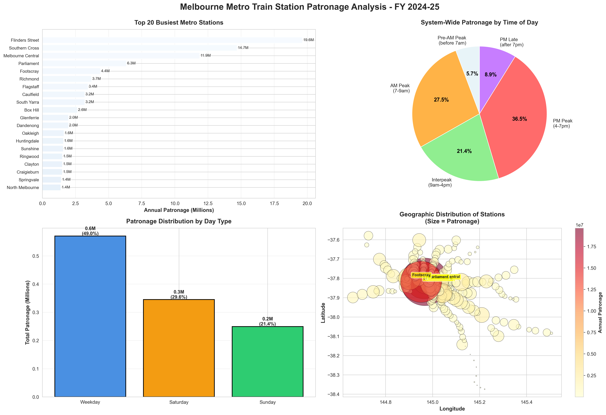

# Melbourne Metro Station Patronage Analysis

Analysis of FY 2024-25 entry patterns across Melbourne's **222 metropolitan
train stations** ([data.vic.gov.au](https://discover.data.vic.gov.au/dataset/annual-metropolitan-train-station-patronage-station-entries)),
identifying congestion hotspots and service-optimization opportunities.



## Key findings

- **Peak concentration** — 64% of a typical weekday's entries fall in the AM
  (27.5%) and PM (36.5%) peaks.
- **Commuter-driven** — ~83% of annual patronage is on weekdays, ~17% on
  weekends (Saturday ~10%, Sunday ~7%).
- **Extreme skew** — Flinders Street (19.6M/yr), Southern Cross (14.7M) and
  Melbourne Central (11.9M) dominate; busiest-to-quietest ratio ≈ 7,850:1.
- **CBD load** — the top five CBD stations handle ~31% of all entries.

## Methodology note (weighted day-type shares)

The dataset reports *average entries per day* for weekdays, Saturdays and
Sundays. To get an annual share, each daily average must be weighted by how many
of that day type occur in the financial year (~261 weekdays vs ~52 Saturdays and
~52 Sundays) — comparing the raw daily averages 1:1 overstates the weekend to
~51%. The weighted figures above (~83% / ~17%) reconcile to the reported annual
totals within 0.7%.

## Recommendations

- **Tiered service** — classify stations High (top 20, >2M/yr) / Medium (next
  80) / Low (remaining ~120), and trim off-peak frequency on the low tier.
- **Peak management** — off-peak pricing incentives to shift demand out of the
  AM/PM peaks without adding services.
- **CBD capacity** — prioritise throughput upgrades at the five CBD stations
  carrying ~31% of the load.

## Reproduce

```bash
pip install pandas matplotlib seaborn
python src/explore.py     # structure + sanity checks
python src/analyze.py     # weighted shares, peak concentration, rankings
python src/visualize.py   # 4-panel dashboard
```

## Stack

Python · pandas · matplotlib · seaborn

---

**Tauseef Mohammed Aoun** — Master of Data Science, Monash University
· [GitHub](https://github.com/Tauseef-hub) · [LinkedIn](https://www.linkedin.com/in/tauseef-aoun)
